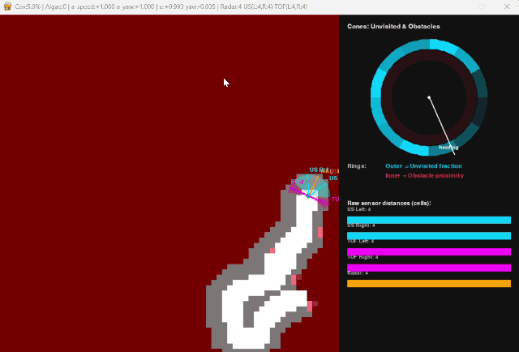
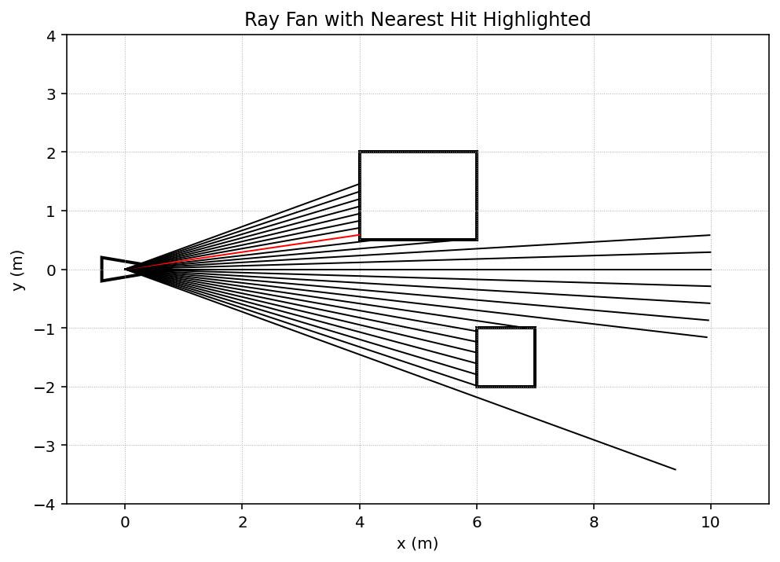
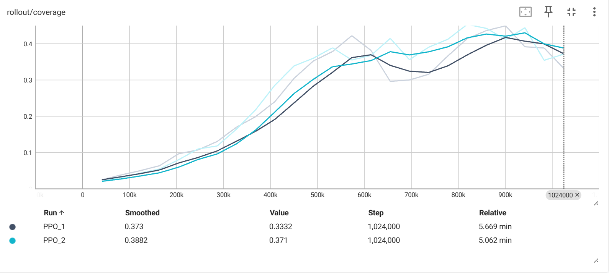
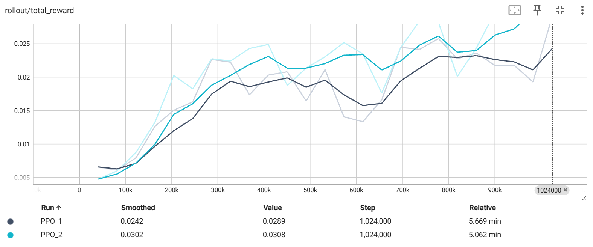
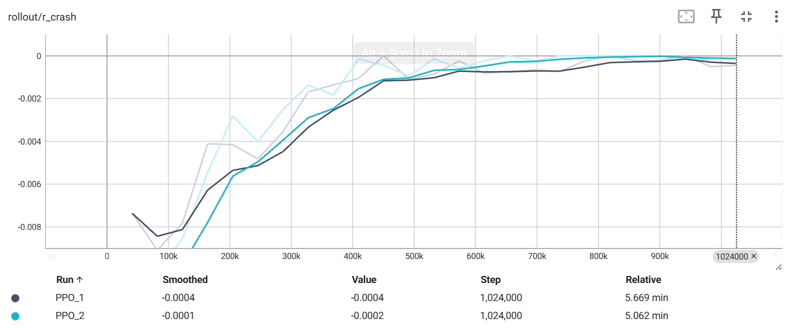
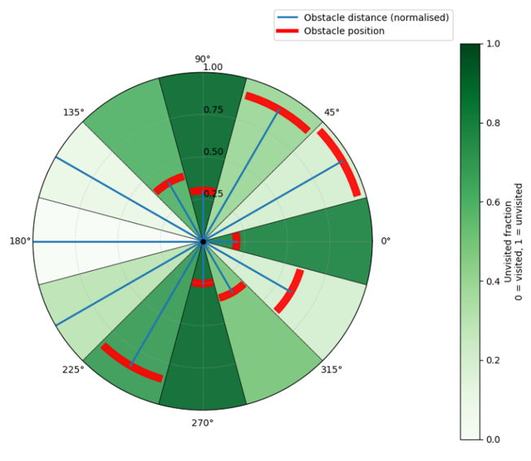
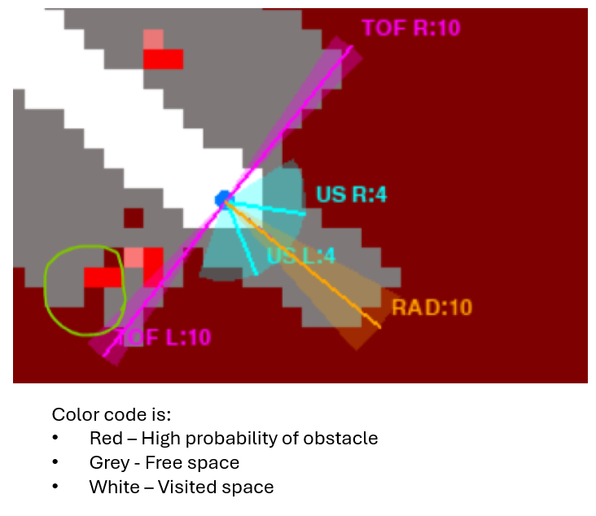
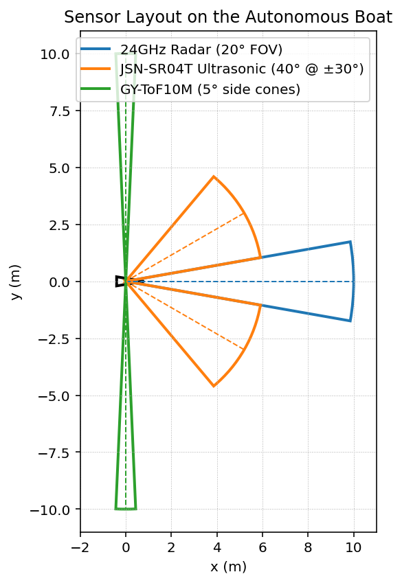
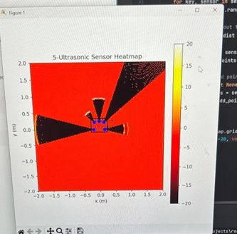
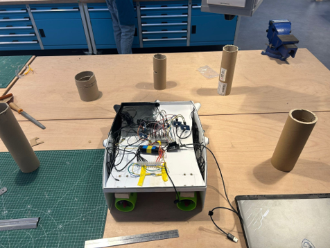

# Autonomous Boat Navigation — PPO Reinforcement Learning

A PPO-trained autonomous navigation agent for an unmanned surface vessel (USV), with a custom Gymnasium environment, real-time sensor integration via ESP32, and deployment onto physical hardware.



---

## What it Does

The agent navigates a simulated lake using its GPS position and onboard sensor readings — no pre-built map, no global knowledge. Sensor data is processed through a Bayesian probability map which filters out noise and accumulates evidence of obstacle positions over time. That map, combined with a record of visited cells, feeds a directional cone observation that tells the agent where free space and obstacles lie in each direction around it. A PPO policy then outputs continuous thrust and yaw commands to maximise area coverage while avoiding collisions.

The boat's physics are modelled with simplified (non-CFD) dynamics covering thrust response, drag, yaw rate, slew-limited commands, and speed-dependent turn radius — sufficient to produce realistic motion behaviour for policy training without the computational cost of full fluid simulation.

Once trained, the agent runs live on a physical boat: an ESP32 reads sensor data over serial and the model outputs commands back to the motors in real time.

---

## How it Works

### Navigation Pipeline

The agent's observation at each step combines:
- **GPS position** — normalised (x, y) coordinates within the environment
- **Heading** — expressed as sin/cos to avoid angle discontinuities
- **Sensor distances** — ultrasonic (left/right) and radar (forward), normalised and noise-augmented
- **Velocity and yaw rate** — current speed and turn rate, normalised
- **Previous action** — last commanded speed and yaw, giving the policy temporal context
- **Directional cone map** — 12 sectors describing obstacle proximity and unexplored space in each direction (see below)

### Ray Casting

Each sensor is modelled as a fan of rays spanning its field of view. At every step, rays are marched cell-by-cell through the grid until they hit an obstacle or reach max range. The shortest hit across the fan gives the sensor reading. All precomputed ray directions are cached at startup (`Configuration.py → precompute_ray_lines`) so no trigonometry is repeated during training.



The red ray above shows the nearest hit within the fan — the reading the policy receives. Rays that clear all obstacles continue to max range and mark those cells as free space.

### Bayesian Probability Map

Raw sensor readings are noisy — a single return could be a real obstacle or interference. Rather than acting on individual readings, each hit updates a **log-odds probability map** across the grid. Every detected surface increments the log-odds at that cell; every clear ray decrements it. Over multiple passes, genuine obstacles accumulate to high probability while noise averages out. This map is displayed as the red overlay in the simulation viewer and directly feeds the cone observation.

---

## Results

Two PPO training runs over **1 million environment steps** across 20 parallel environments.

### Coverage

The agent reaches up to **~80% coverage on accessible map area**, with consistent improvement from ~3% at the start. The TensorBoard mean shown (~38%) is averaged across 20 parallel environments per rollout, each generated from a different random seed — some seeds produce maps where a portion of the lake is physically cut off by obstacles and unreachable by any path. Averaging across those inaccessible configurations pulls the reported metric down significantly. On maps where the full area is reachable, the agent systematically covers the majority of the environment.

### Total Reward

Mean per-step reward increases consistently across training, reflecting better exploration efficiency and fewer crashes over time.

### Crash Rate

Crash penalty starts at around −0.008 early in training and trends toward zero by 500k steps, showing the agent learns reliable obstacle avoidance as exploration improves.

---

## Observation Space — Directional Cone Map



The agent observes its surroundings through **12 equal angular sectors** (cones) radiating from its current position. The probability map and visited cell record are sampled within each cone to produce two values per sector:

- **Green shading (unvisited fraction):** How much unvisited free space lies in that direction — darker green means more unexplored area. This is derived from cells that the probability map has confirmed as free but that the agent has not yet passed through.
- **Red arcs (obstacle proximity):** The normalised distance to the nearest high-probability obstacle within that cone, drawn at the obstacle's position. A red arc close to the centre means a likely obstacle is nearby in that direction.

All cone values are rotated into the **agent's egocentric frame** at each step, so cone index 0 always points in the direction the boat is currently heading. See `Lake_environment.py → compute_cones()` and `translate_egocentric_cone()`.

---

## Simulation Viewer

Run `python View_model.py` to watch the trained agent navigate in real time.



| Colour | Meaning |
|---|---|
| White | Visited cells — areas the agent has physically passed through |
| Grey | Known free space — inferred clear from sensor ray-casting |
| Red | High obstacle probability — log-odds belief map |
| Cyan wedges | Ultrasonic sensor (US) field of view with measured range |
| Magenta wedges | Time-of-Flight (ToF) sensor left/right readings |
| Orange wedge | Forward radar cone |

---

## Sensor Array Design



The planned sensor layout used three sensor types chosen to give the agent dense spatial coverage:

- **24GHz Radar (20° FOV)** — long-range forward obstacle detection
- **JSN-SR04T Ultrasonic (40° @ ±30°)** — medium-range side coverage for left/right clearance
- **GY-ToF10M (5° side cones)** — long-range narrow Time-of-Flight sensors providing precise lateral distance to fill in the free-space map with high resolution

Due to hardware budget constraints, the **GY-ToF10M ToF sensors were replaced with shorter-range ultrasonic sensors** on the physical boat. This had a direct impact on performance: the narrow 5° ToF cones were specifically designed to build a precise picture of free and occupied space in the side directions, which feeds both the probability map and the cone observation. The wider ultrasonic cones are less precise for mapping and have shorter range, meaning the agent had less complete information about its surroundings when running on real hardware compared to simulation.

---

## Real Sensor Integration

The `hardware/` folder contains the Python sensor interface and ESP32 firmware for running the agent on the physical boat.

### Sensor Heatmap


Live occupancy heatmap built from 5 ultrasonic sensors. Free space is pushed negative (dark), detected surfaces push positive (bright). The sensor wedges and boat outline are overlaid for reference. Run with `hardware/live_sensor_viewer.py`.

### Hardware Test Setup


Physical test bench: the boat surrounded by cardboard tube obstacles for sensor validation before water testing. The ESP32 and sensor array are visible on the deck.

---

## Project Structure

**Simulation / Training** (no hardware required)

| File | Purpose |
|---|---|
| `Lake_environment.py` | Gymnasium RL environment — lake map, ray-cast sensors, reward shaping |
| `Configuration.py` | Simulation config dataclass and ray-line precomputation |
| `mapping.py` | Occupancy grid (`HitMap`) with decay and clamp operations |
| `Training.py` | Train a PPO agent from scratch |
| `REtraining.py` | Resume training from a saved checkpoint |
| `View_model.py` | Visualise the trained agent running in simulation (pygame) |

**Hardware** (requires ESP32 + ultrasonic/ToF sensors)

| File | Purpose |
|---|---|
| `hardware/sensor_class.py` | Ultrasonic sensor geometry (arc/free-space point generation) |
| `hardware/serial_reader.py` | USB serial parser for ESP32 CSV packets |
| `hardware/live_sensor_viewer.py` | Hybrid viewer: real sensor data fused with RL model inference |
| `hardware/combined_sensor_motor/` | Arduino firmware for ESP32 (sensor reading + motor control) |

---

## Setup

```bash
pip install -r requirements.txt
```

## Usage

**Train from scratch:**
```bash
python Training.py
```

**Continue training from checkpoint:**
```bash
python REtraining.py
```

**Visualise trained agent (simulation):**
```bash
python View_model.py
```

**Run on hardware (ESP32 connected via USB):**
```bash
python hardware/live_sensor_viewer.py
```
Set `COM_PORT` in `hardware/live_sensor_viewer.py` to match your ESP32's serial port.

**View training curves:**
```bash
tensorboard --logdir runs/ppo_lake
```

---

## Hardware

- ESP32 microcontroller running `hardware/combined_sensor_motor/combined_sensor_motor.ino`
- 5× JSN-SR04T ultrasonic sensors
- 2× short-range ultrasonic sensors (replacing planned GY-ToF10M due to budget)
- 24GHz radar module
- Brushless motors with ESC

## Trained Model

A trained model is included in `runs/ppo_lake/` (`best_model.zip` + `vecnorm.1`). Load it with `View_model.py` or `hardware/live_sensor_viewer.py` without retraining.
